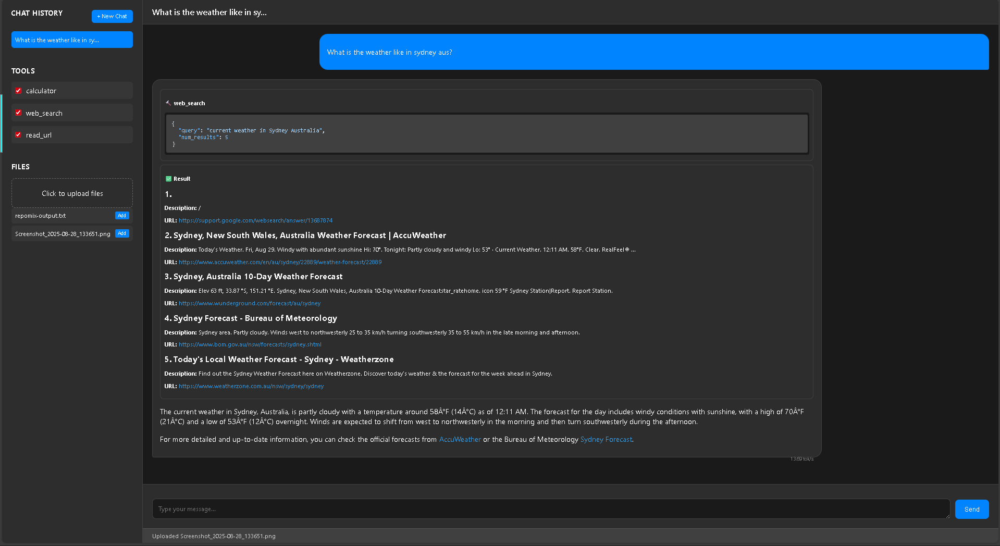

# LLM Chat Application

A full-stack Python/Flask application with a built-in LLM interface that allows users to interact with a large language model through a web-based chat interface.

## Features

- Real-time streaming responses with progress indicators
- Support for multiple tools including calculator, web search, and URL reading
- File upload and management (text and images)
- Chat history with ability to edit and delete messages
- Tool toggling to enable/disable specific tools
- Responsive design with dark theme

## Technologies Used

- **Backend**: Python (Flask, requests, dotenv)
- **Frontend**: HTML, CSS, JavaScript (with marked.js for markdown rendering)
- **LLM Backend**: llama.cpp server (running on localhost:11434)
- **Database**: Pickle for persistent storage of chat history

## How to Run

### 1. Setup Environment

1. Clone the repository
2. Create a virtual environment and activate it
3. Install dependencies:
```bash
pip install -r requirements.txt
```

### 2. Configure Environment Variables

Create a `.env` file in the root directory with the following content:
```
FLASK_SECRET_KEY=...
APP_PASSWORD=...
UPLOAD_FOLDER=...
MAX_CONTENT_LENGTH=16777216 # max bytes per file upload
LLAMA_URL=http://<endpoint>:11434/v1/chat/completions
```

### 3. Start the LLM Server

Ensure llama.cpp [llama-server](https://github.com/ggml-org/llama.cpp/blob/master/tools/server/README.md) is running on `http://<endpoint>:11434`.

### 4. Run the Application

Start the Flask server:
```bash
python app.py
```

The application will be available at `http://localhost:5555`.

## Example

